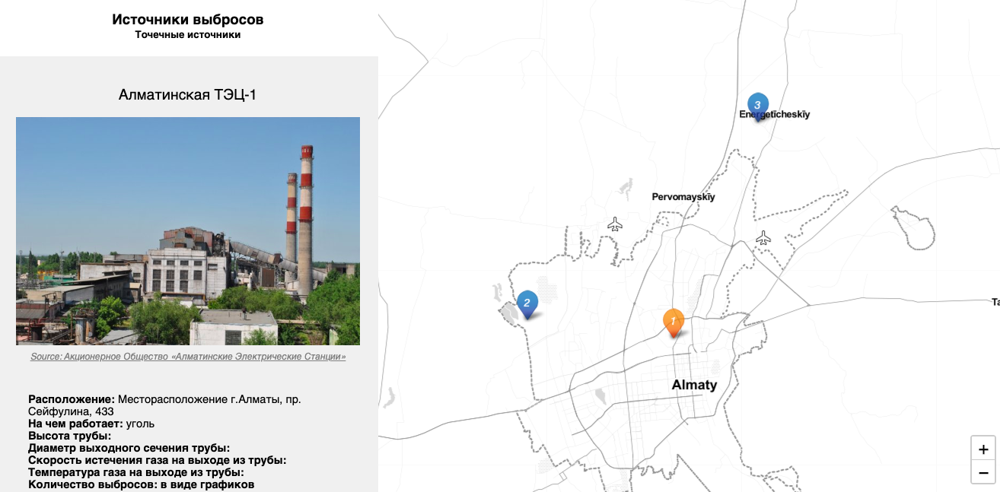

# Leaflet Emission Sources Map with Google Sheets

## [Live Demo](https://github.com/mis180/Emission_Sources/index.html)
- The map is hosted by GitHub and can be found at https://mis180.github.io/Emission_Sources/index.html

- Google Sheets template https://docs.google.com/spreadsheets/d/1jf7PLrn7R_avS0PyY6Jp8_nfGiG5VpGamxgw0P4_RQk/edit#gid=0

## Credits

Developed by [Ilya Ilyankou](https://github.com/ilyankou) and [Jack Dougherty](https://github.com/jackdougherty) with support from Trinity College, CT.

## License
MIT
