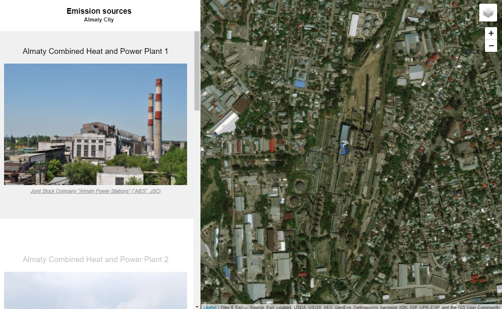

# Leaflet Emission Sources Map with Google Sheets

## [Live Demo](https://github.com/mis180/Web-GIS/blob/main/Leaflet_Emission_Sources_Map_with_Google_Sheets/index.html)
- The map is hosted by GitHub and can be found [here](https://mis180.github.io/Emission_Sources/index.html)

- Google Sheets template can be found [here](https://docs.google.com/spreadsheets/d/1jf7PLrn7R_avS0PyY6Jp8_nfGiG5VpGamxgw0P4_RQk/edit#gid=0)

####This was the first step in working with LeafLeat web maps. 

####Then more advanced web map applications on Emission Sources prediction were created using Django Framework that deplyed on Heroku cloud platform and can be found [here](https://almatyemission.herokuapp.com/) and [here](https://aadapp.herokuapp.com/). 

## License
MIT
Developed by [Ilya Ilyankou](https://github.com/ilyankou) and [Jack Dougherty](https://github.com/jackdougherty) with support from Trinity College, CT.

