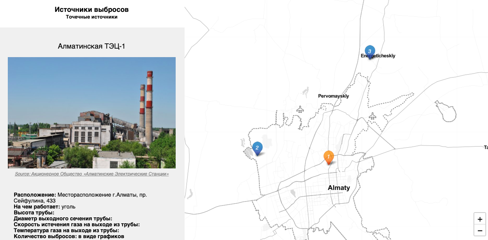

# Leaflet Emission_Sources Map with Google Sheets

## [Live Demo](https://github.com/mis180/Emission_Sources/index.html)
- The map is hosted by GitHub and can be found at https://mis180.github.io/Emission_Sources/index.html

- Google Sheets template https://docs.google.com/spreadsheets/d/1jf7PLrn7R_avS0PyY6Jp8_nfGiG5VpGamxgw0P4_RQk/edit#gid=0

## Credits
Developed by [Ilya Ilyankou](https://github.com/ilyankou) and [Jack Dougherty](https://github.com/jackdougherty) with support from Trinity College, CT.

Inspired by Code for Atlanta mapsfor.us (2016) https://github.com/codeforatlanta/mapsforus (BSD-3-Clause). Adapted from MUX Lab, Map Effects 100: https://github.com/muxlab/map-effects-100, see http://muxlab.github.io/map-effects-100/Leaflet/11_scroll-driven-map-navigation.html. Uses a [Google Sheets](https://www.google.com/sheets/about/) template.

## Built Using These Libraries

| Library | Version | License | Notes |
|--       |--       |--       |--
| [Leaflet](https://leafletjs.com)| 1.4.0 | BSD-2-Clause | https://leafletjs.com
| [jQuery](https://code.jquery.com) | 3.3.1| MIT | https://code.jquery.com
| [leaflet-providers](https://github.com/leaflet-extras/leaflet-providers) | 1.1.15 | BSD-2-Clause | Manually updated for Carto https https://github.com/leaflet-extras/leaflet-providers |
| [Leaflet.awesome-markers](https://github.com/sigma-geosistemas/Leaflet.awesome-markers) | 2.0.4 | MIT | https://github.com/sigma-geosistemas/Leaflet.awesome-markers |
| [Single Element CSS Spinner](https://github.com/lukehaas/css-loaders) | May 31, 2016| MIT| https://github.com/lukehaas/css-loaders|
| [Tabletop](https://github.com/jsoma/tabletop) | 1.5.1 | MIT | Fetches data from Google Sheet template. https://github.com/jsoma/tabletop
| [Google Sheets Geocoder](https://github.com/jackdougherty/google-sheets-geocoder) | 1.0 | No License | By Ilya Ilyankou and Jack Dougherty https://github.com/jackdougherty/google-sheets-geocoder
| [jQuery-CSV](https://github.com/evanplaice/jquery-csv) | 0.71 | MIT | https://github.com/evanplaice/jquery-csv
| [Leaflet.ExtraMarkers](https://github.com/coryasilva/Leaflet.ExtraMarkers) | ? | MIT | https://github.com/coryasilva/Leaflet.ExtraMarkers
| [FontAwesome](https://fontawesome.com) | 5.8.1 | Font Awesome Free License | https://fontawesome.com |

## License
MIT
